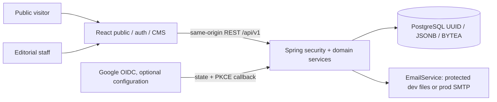

# Architecture
React 19 SPA → Spring Boot 3 REST monolith → PostgreSQL (Supabase for the current development preview; Docker for isolated QA). No browser database credentials. Package by domain. REST DTOs; JPA for user identity and JDBC for transactional security/content workflows with explicit SQL constraints. Binary media is BYTEA behind MediaStorage.
Frontend: Router, Query, Axios, Hook Form/Zod, i18next, Helmet, TipTap, Motion/Lucide. Routes split by public, auth and admin.
Security: signed short JWT tied to an active persisted session; rotating opaque refresh cookie; HMAC OTP; Argon2id; encrypted TOTP; single-use hashed recovery codes; CSRF on cookie transitions. Privilege is looked up from DB on every request.

Frontend has lazy public/auth/admin routes, one QueryClient, typed DTOs, in-memory auth context, a single-flight token renewal handler and an Axios boundary. Validation uses RHF/Zod; rich content is a constrained TipTap document rendered with allowlisted React elements. The language preference is the only persistent browser storage. Account and admin routes always use noindex metadata.

Backend domains: auth, security, user, content, media, contact, setting, audit and config. OAuth chain is conditional and separate from the stateless API chain. Services own transactions for session, OTP, role and content workflows. JPA validates the identity entity; JDBC provides explicit locking/query behavior; MapStruct maps identity DTOs and the BYTEA storage adapter provides a future storage boundary without changing clients.

Fixed corporate layouts are persisted content, not a generic HTML/CSS page builder. Content kinds share normalized tables; translations preserve entity identity. Seven homepage sections refer to published items of the correct kind. VI slugs are stable public canonical routes for translated details. Rich bodies are omitted from list/homepage summaries and loaded by detail/editor endpoints.

Local PostgreSQL is a persistent Docker volume; integration PostgreSQL is a separate disposable Testcontainers instance. Both run the same Flyway migrations. The current local application connects to the reviewed Supabase development project and Gmail SMTP configuration; actual integration history is recorded in SUPABASE_SMTP_REPORT. Tests use Docker/file mail, not that remote database or sender. RLS denies platform guest access while the authorized backend DB role enforces app RBAC.

No deployment topology is applied. The production plan calls for HTTPS reverse proxy + static frontend dist + one Spring monolith + PostgreSQL. It requires reviewed credentials, network controls and header policy before activation.

Phase 2 keeps separate public (5173) and admin (5180) origins and builds. Admin authentication shares the existing API/security model; separate ports are a presentation boundary, not an authorization boundary. Remote temporary hero images are HTTPS URLs on exact Pexels/Unsplash image hosts, rendered by the browser with anonymous CORS/no-referrer; other media uses existing BYTEA storage and protected media endpoints.

An explicit dev-only Supabase preview seed runner requires two disabled-by-default flags and exact target/manifest checks. It reuses transactional domain services and audit records, tracks stable state, and skips owner changes. Node scripts only prepare fixed assets/manifests or orchestrate QA; they are not an application backend. The HTTP CMS still requires normal RBAC/MFA. Seven fixed homepage sections can be reordered atomically, with exact membership validation and row locks.
